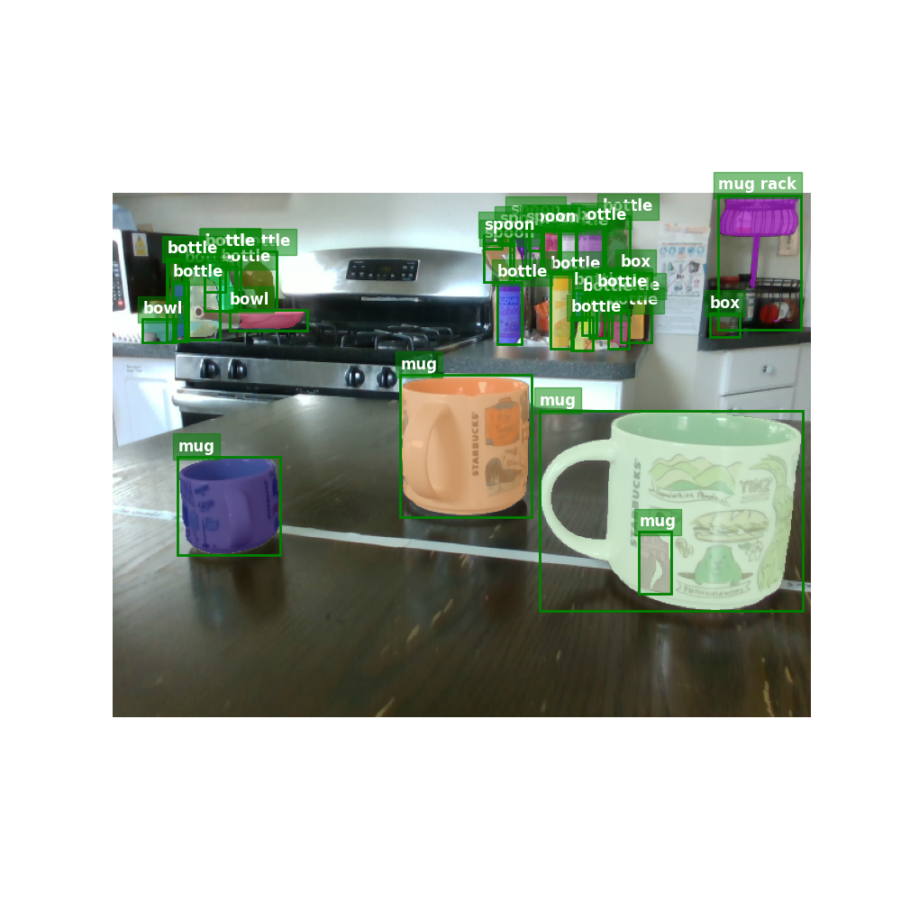
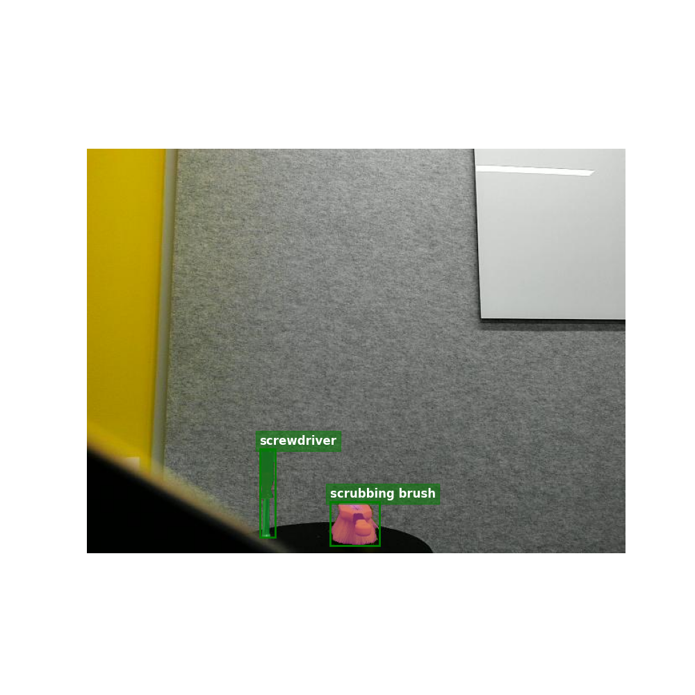

# Open Vocabulary Object Detection and Segmentation with Detic and Segment Anything

This repo uses [Detic](https://github.com/facebookresearch/Detic) to detect objects based on a text description of each class (i.e. open-vocabulary detection). It then conditions the [Segment Anything](https://github.com/facebookresearch/segment-anything) model with the detected bounding boxes to get segmentation masks.




## Setup

Either run `./setup.sh` or follow the steps manually.

## Usage

Segmenting example images `1.png` and `2.png`.
```
source venv/bin/activate
python main.py 1.png -c bottle mug spoon "mug rack" box cpu bowl -d "cuda:0"
python main.py 2.png -c screwdriver "scrubbing brush" -d "cuda:0"
```

## Licenses and Acks

This code is based on [prediction_in_wild](https://github.com/pagidik/prediction_in_wild), which was made by my MS student Kishore Pagidi and is licensed under MIT.
His repository in turn uses [detectron2](https://github.com/facebookresearch/detectron2), [Detic](https://github.com/facebookresearch/Detic) and [SAM](https://github.com/facebookresearch/segment-anything), which are licensed under Apache-2.0.
